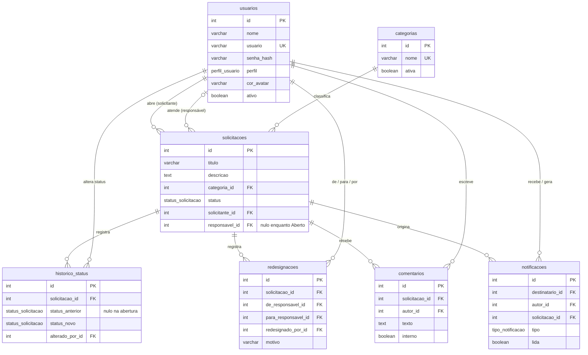

# Dicionário de Dados — Portal de Solicitações Internas

Banco: **PostgreSQL 17**. A estrutura é criada pelas migrations do Prisma (`backend/prisma/migrations`) e está consolidada em [`schema.sql`](schema.sql).

Convenções:
- Tabelas e colunas em `snake_case` (no código TypeScript os mesmos campos aparecem em `camelCase`).
- Chaves primárias `id SERIAL` (inteiro autoincremental).
- Datas em `TIMESTAMPTZ(3)` (com fuso horário, precisão de milissegundos).
- Textos com limite usam `VARCHAR(n)`; textos livres longos usam `TEXT`.

## Diagrama entidade-relacionamento

## Tipos enumerados

| Tipo | Valores | Uso |
|---|---|---|
| `perfil_usuario` | `SOLICITANTE`, `ATENDENTE`, `GERENTE` | Perfil de acesso. Hierarquia: solicitante < atendente < gerente (o gerente faz tudo que o atendente faz e administra o sistema). |
| `status_solicitacao` | `ABERTO`, `EM_ATENDIMENTO`, `CONCLUIDO` | Situação da solicitação. Fluxo só avança: Aberto → Em Atendimento → Concluído. |
| `tipo_notificacao` | `NOVA_SOLICITACAO`, `STATUS_ALTERADO`, `NOVO_COMENTARIO`, `REDESIGNADA` | Motivo de uma notificação. |

---

## `usuarios`
Pessoas que acessam o portal. Contas não são excluídas, apenas desativadas (preserva o histórico).

| Coluna | Tipo | Nulo | Padrão | Restrições | Descrição |
|---|---|---|---|---|---|
| `id` | `SERIAL` | não | autoincremento | PK | Identificador. |
| `nome` | `VARCHAR(100)` | não | — | — | Nome de exibição (3 a 100 caracteres, validado na API). |
| `usuario` | `VARCHAR(50)` | não | — | UNIQUE | Login. Minúsculas, números, `.`, `-` e `_`. |
| `senha_hash` | `VARCHAR(255)` | não | — | — | Hash **bcrypt** da senha (custo 10). A senha nunca é armazenada nem devolvida pela API. |
| `perfil` | `perfil_usuario` | não | `SOLICITANTE` | — | Perfil de acesso. |
| `cor_avatar` | `VARCHAR(20)` | não | `'indigo'` | — | Chave da cor do avatar escolhida em "Meu perfil" (lista fixa validada na API). As chaves são estáveis e a interface traduz para a paleta: `indigo` = framboesa, `sky` = ameixa, `emerald` = oliva, `slate` = areia; `teal`, `amber`, `orange`, `rose`, `violet` mantêm o nome. |
| `ativo` | `BOOLEAN` | não | `true` | — | Conta desativada não entra e perde o acesso imediatamente. |
| `criado_em` | `TIMESTAMPTZ(3)` | não | `now()` | — | Data de cadastro. |
| `atualizado_em` | `TIMESTAMPTZ(3)` | não | `now()` | — | Última alteração (mantida pelo Prisma). |

## `categorias`
Classificação das solicitações, administrada pelo gerente.

| Coluna | Tipo | Nulo | Padrão | Restrições | Descrição |
|---|---|---|---|---|---|
| `id` | `SERIAL` | não | autoincremento | PK | Identificador. |
| `nome` | `VARCHAR(50)` | não | — | UNIQUE | Nome exibido (ex.: TI, RH, Compras). |
| `ativa` | `BOOLEAN` | não | `true` | — | Categoria inativa não aceita novas solicitações, mas continua nas antigas. |
| `criado_em` | `TIMESTAMPTZ(3)` | não | `now()` | — | Data de cadastro. |

Regra: categoria com solicitações **não pode ser excluída** (só desativada).

## `solicitacoes`
Demandas registradas pelos colaboradores. A coluna `id` é o **código** exibido na interface (ex.: `#0007`).

| Coluna | Tipo | Nulo | Padrão | Restrições | Descrição |
|---|---|---|---|---|---|
| `id` | `SERIAL` | não | autoincremento | PK | Código da solicitação. |
| `titulo` | `VARCHAR(150)` | não | — | — | Resumo (3 a 150 caracteres). |
| `descricao` | `TEXT` | não | — | — | Detalhamento (10 a 5000 caracteres, validado na API). |
| `categoria_id` | `INTEGER` | não | — | FK → `categorias.id` (RESTRICT) | Categoria. |
| `status` | `status_solicitacao` | não | `ABERTO` | — | Situação atual. Definida pelo sistema, nunca pelo formulário. |
| `solicitante_id` | `INTEGER` | não | — | FK → `usuarios.id` (RESTRICT) | Quem abriu (usuário da sessão). |
| `responsavel_id` | `INTEGER` | sim | — | FK → `usuarios.id` (RESTRICT) | Quem atende. Preenchido ao passar para *Em Atendimento*; pode ser trocado pelo gerente (ver `redesignacoes`). |
| `criado_em` | `TIMESTAMPTZ(3)` | não | `now()` | — | Data de abertura. |
| `atualizado_em` | `TIMESTAMPTZ(3)` | não | — | — | Última alteração (mantida pelo Prisma). |

Índices: `status`; `(responsavel_id, status)` (limite de atendimentos e filtro "Minhas"); `categoria_id`; `criado_em` (filtro por período e ordenação); `solicitante_id`.

Regras principais:
- Editar e excluir: só o solicitante, e só enquanto `ABERTO`.
- Cada pessoa da equipe pode ter no máximo **3** solicitações `EM_ATENDIMENTO` como responsável.

## `historico_status`
Trilha de cada mudança de status (inclui a abertura).

| Coluna | Tipo | Nulo | Padrão | Restrições | Descrição |
|---|---|---|---|---|---|
| `id` | `SERIAL` | não | autoincremento | PK | Identificador. |
| `solicitacao_id` | `INTEGER` | não | — | FK → `solicitacoes.id` (CASCADE) | Solicitação. |
| `status_anterior` | `status_solicitacao` | sim | — | — | Status antes da mudança (nulo no registro de abertura). |
| `status_novo` | `status_solicitacao` | não | — | — | Status depois da mudança. |
| `alterado_por_id` | `INTEGER` | não | — | FK → `usuarios.id` (RESTRICT) | Quem fez a mudança. |
| `alterado_em` | `TIMESTAMPTZ(3)` | não | `now()` | — | Quando. |

Índice: `solicitacao_id`.

## `redesignacoes`
Trocas de responsável feitas pelo gerente em solicitações em atendimento.

| Coluna | Tipo | Nulo | Padrão | Restrições | Descrição |
|---|---|---|---|---|---|
| `id` | `SERIAL` | não | autoincremento | PK | Identificador. |
| `solicitacao_id` | `INTEGER` | não | — | FK → `solicitacoes.id` (CASCADE) | Solicitação. |
| `de_responsavel_id` | `INTEGER` | não | — | FK → `usuarios.id` (RESTRICT) | Responsável anterior. |
| `para_responsavel_id` | `INTEGER` | não | — | FK → `usuarios.id` (RESTRICT) | Novo responsável. |
| `redesignado_por_id` | `INTEGER` | não | — | FK → `usuarios.id` (RESTRICT) | Gerente que fez a troca. |
| `motivo` | `VARCHAR(300)` | sim | — | — | Justificativa opcional. |
| `redesignado_em` | `TIMESTAMPTZ(3)` | não | `now()` | — | Quando. |

Restrição: `CHECK (de_responsavel_id <> para_responsavel_id)`. Índice: `solicitacao_id`.

## `comentarios`
Conversa da solicitação. Comentários são **imutáveis** (não há edição nem exclusão).

| Coluna | Tipo | Nulo | Padrão | Restrições | Descrição |
|---|---|---|---|---|---|
| `id` | `SERIAL` | não | autoincremento | PK | Identificador. |
| `solicitacao_id` | `INTEGER` | não | — | FK → `solicitacoes.id` (CASCADE) | Solicitação. |
| `autor_id` | `INTEGER` | não | — | FK → `usuarios.id` (RESTRICT) | Quem escreveu. |
| `texto` | `TEXT` | não | — | — | Conteúdo (1 a 2000 caracteres, validado na API). |
| `interno` | `BOOLEAN` | não | `false` | — | Nota interna: visível só para atendentes e gerentes; só a equipe pode criar. |
| `criado_em` | `TIMESTAMPTZ(3)` | não | `now()` | — | Quando. |

Índice: `(solicitacao_id, criado_em)`.

## `notificacoes`
Avisos exibidos no sino. Uma linha por destinatário.

| Coluna | Tipo | Nulo | Padrão | Restrições | Descrição |
|---|---|---|---|---|---|
| `id` | `SERIAL` | não | autoincremento | PK | Identificador. |
| `destinatario_id` | `INTEGER` | não | — | FK → `usuarios.id` (CASCADE) | Quem recebe. |
| `autor_id` | `INTEGER` | não | — | FK → `usuarios.id` (CASCADE) | Quem causou o aviso. |
| `solicitacao_id` | `INTEGER` | não | — | FK → `solicitacoes.id` (CASCADE) | Solicitação relacionada. |
| `tipo` | `tipo_notificacao` | não | — | — | Motivo do aviso. |
| `mensagem` | `VARCHAR(300)` | não | — | — | Texto pronto para exibição. |
| `lida` | `BOOLEAN` | não | `false` | — | Marcada ao clicar, ao "marcar todas" ou ao **abrir a solicitação**. |
| `criado_em` | `TIMESTAMPTZ(3)` | não | `now()` | — | Quando. |

Índice: `(destinatario_id, lida, criado_em)` (contador de não lidas e listagem).

Quem recebe cada tipo (ninguém é notificado da própria ação; usuários inativos não recebem):

| Tipo | Destinatários |
|---|---|
| `NOVA_SOLICITACAO` | Toda a equipe ativa (atendentes e gerentes). Enquanto não lida, a solicitação aparece com o selo **"Nova"** para aquela pessoa. |
| `STATUS_ALTERADO` | O solicitante. |
| `NOVO_COMENTARIO` | O solicitante (se o comentário for público) e o responsável. |
| `REDESIGNADA` | Novo responsável, responsável anterior e solicitante. |

---

## Políticas de exclusão (chaves estrangeiras)

- **CASCADE** — registros dependentes de uma solicitação (histórico, redesignações, comentários, notificações) são removidos com ela. Só solicitações *Abertas* podem ser excluídas.
- **RESTRICT** — impede remover usuários e categorias que ainda são referenciados. Na prática, usuários são **desativados** e categorias em uso são **desativadas**, preservando a integridade do histórico.
