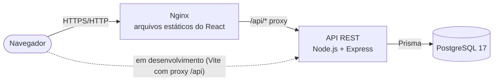
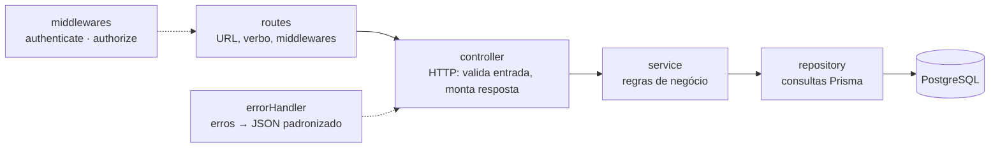

# Memorial Técnico de Desenvolvimento

**Projeto:** Portal de Solicitações Internas
**Processo:** Seleção DEV Jr. 09/2026 — bit Soluções (2ª etapa)
**Repositório:** https://github.com/Brunera17/Portal-de-solicita-es

Este documento registra *o que* foi usado, *por que* foi usado e *como* a solução foi pensada — incluindo as decisões tomadas onde o enunciado deixava margem de interpretação, os problemas encontrados no caminho e o que seria diferente em um ambiente corporativo de produção.

## Sumário

1. [Visão geral da solução](#1-visão-geral-da-solução)
2. [Interpretação dos requisitos](#2-interpretação-dos-requisitos)
3. [Tecnologias utilizadas](#3-tecnologias-utilizadas)
4. [Justificativa técnica](#4-justificativa-técnica)
5. [Justificativa conceitual](#5-justificativa-conceitual)
6. [Estratégia de qualidade e testes](#6-estratégia-de-qualidade-e-testes)
7. [Processo de desenvolvimento e problemas resolvidos](#7-processo-de-desenvolvimento-e-problemas-resolvidos)
8. [Análise crítica](#8-análise-crítica)

---

## 1. Visão geral da solução

Aplicação web composta por três partes independentes, que conversam por HTTP:

- **Frontend (SPA):** React + TypeScript, compilado pelo Vite em arquivos estáticos e servido pelo Nginx.
- **Backend (API REST):** Node.js + Express + TypeScript, organizado em módulos e camadas.
- **Banco:** PostgreSQL 17, com a estrutura versionada por migrations do Prisma.

Tudo sobe com `docker compose up -d --build`. O CI no GitHub Actions valida lint, tipos, 127 testes automatizados e a subida completa via Docker a cada push.

Números do projeto: ~1.600 linhas de TypeScript no backend, ~4.500 no frontend, 7 tabelas, 5 migrations, 127 testes (54 unitários + 73 de integração da API).

---

## 2. Interpretação dos requisitos

O enunciado deixa alguns pontos em aberto. As decisões abaixo foram tomadas de forma explícita e implementadas tanto na interface quanto na API (a regra vale mesmo que alguém chame a API diretamente).

| Ponto em aberto | Decisão | Motivo |
|---|---|---|
| Quem altera o status? | Perfis distintos: **Solicitante** abre e acompanha; **Atendente** assume e conclui; **Gerente** faz o que o atendente faz e administra. | Sem separação, qualquer pessoa poderia "concluir" a própria solicitação, o que esvazia o controle do atendimento. |
| O solicitante vê as solicitações dos outros? | Não. Solicitante vê só as próprias; a equipe vê todas. O dashboard segue o mesmo escopo. | Solicitações podem conter dados pessoais (ex.: RH, dados bancários). |
| Quais transições de status são válidas? | Só avança, uma etapa por vez: Aberto → Em Atendimento → Concluído. Concluído é final. | Fluxo simples e auditável; reabertura ficou como melhoria futura (seção 8). |
| "Editar/Excluir solicitação aberta" | Apenas o **próprio solicitante**, e apenas enquanto *Aberta*. | Depois que o atendimento começa, mudar o pedido confundiria quem está atendendo. |
| Exclusão física ou lógica? | Física para solicitações (só abertas, ainda sem atendimento). Lógica (desativação) para usuários e categorias. | Uma solicitação aberta ainda não tem histórico relevante; já usuários e categorias são referenciados por registros que precisam ser preservados. |
| Categorias "sugeridas" | Viraram uma **tabela administrável** pelo gerente, com as 5 sugeridas no seed. | "Sugeridas" indica que a lista pode mudar; uma enumeração fixa exigiria nova versão do sistema para cada categoria. |
| Cadastro de usuários | Não há auto-cadastro; o **gerente** cria e gerencia contas. Usuários de demonstração vêm do seed. | É um portal interno: contas devem ser concedidas, não criadas livremente. |
| "Período" no filtro | Data de **abertura**, com data final inclusiva. | É a data exibida na listagem e a mais útil para consultas como "o que foi aberto este mês". |

Também foram incorporadas melhorias pedidas durante o desenvolvimento: quadro Kanban, limite de 3 atendimentos simultâneos por pessoa, responsável e redesignação, comentários com notas internas, notificações, destaque de solicitações novas, perfil do usuário, modo escuro e navegação lateral.

---

## 3. Tecnologias utilizadas

| Categoria | Tecnologia | Versão |
|---|---|---|
| Linguagem | TypeScript (backend e frontend) | 5.9 |
| Runtime | Node.js | 24 |
| Framework backend | Express | 5.2 |
| ORM / migrations | Prisma | 6.19 |
| Banco de dados | PostgreSQL | 17 |
| Validação | Zod (backend e frontend) | 4.6 |
| Autenticação | JSON Web Token (`jsonwebtoken`) + `bcryptjs` | 9.0 / 3.0 |
| Segurança HTTP | Helmet, CORS, `express-rate-limit` | 8.3 / 2.8 / 8.7 |
| Framework frontend | React | 19.3 |
| Build frontend | Vite (empacotador Rolldown) | 8.3 |
| Rotas | React Router | 7.18 |
| Dados no cliente | TanStack Query + Axios | 5.104 / 1.20 |
| Formulários | React Hook Form + `@hookform/resolvers` | 7.89 |
| Estilo | Tailwind CSS (+ `tailwind-merge`, `clsx`) | 4.3 |
| Arrastar e soltar | `@dnd-kit/core` | 6.3 |
| Avisos (toasts) / ícones | Sonner / Lucide | 2.0 / 1.49 |
| Testes | Vitest + Supertest | 5.0 / 7.3 |
| Qualidade de código | ESLint (+ `typescript-eslint`, regras de hooks do React) | 9 |
| Containerização | Docker, Docker Compose, Nginx | Compose v2 / Nginx 1.29 |
| CI | GitHub Actions | — |
| Serviços em nuvem | Nenhum além do GitHub (repositório e CI) | — |

---

## 4. Justificativa técnica

Para cada tecnologia: **motivo** da escolha, **benefícios** no cenário, **vantagens** sobre alternativas conhecidas e **impacto** em manutenção, escalabilidade ou produtividade.

### 4.1 TypeScript (backend e frontend)
- **Motivo:** uma única linguagem nas duas pontas, com tipagem estática.
- **Benefícios:** erros de contrato (campo renomeado, tipo errado) aparecem na compilação. Quando a categoria deixou de ser um texto e virou um objeto `{ id, nome }`, o compilador apontou cada tela afetada.
- **Vantagens:** sobre JavaScript puro, segurança em refatorações; sobre usar linguagens diferentes em cada ponta (ex.: Java + JS), uma só sintaxe, ferramenta e ecossistema.
- **Impacto:** refatorações grandes (houve várias) ficaram seguras e rápidas. A versão 5.9 foi escolhida em vez da 7 (recém-lançada, reescrita em Go) por compatibilidade comprovada com ESLint, Vite e Prisma.

### 4.2 Node.js 24
- **Motivo:** runtime de TypeScript no servidor, versão LTS atual.
- **Benefícios:** modelo assíncrono adequado a uma API que passa a maior parte do tempo esperando o banco.
- **Vantagens:** sobre versões anteriores, suporte de longo prazo mais extenso; sobre outras plataformas, compartilha linguagem e ferramentas com o frontend.
- **Impacto:** a mesma versão é usada no desenvolvimento, no Docker (`node:24-alpine`) e no CI, eliminando diferenças entre ambientes.

### 4.3 Express 5
- **Motivo:** framework HTTP mínimo e amplamente conhecido.
- **Benefícios:** a versão 5 propaga erros de handlers `async` automaticamente para o tratador de erros — sem `try/catch` repetido em cada rota.
- **Vantagens:** sobre NestJS, menos "mágica" e menor curva de aprendizado, deixando a arquitetura em camadas explícita no código (o que este desafio avalia); sobre Fastify, ecossistema e familiaridade maiores, com desempenho mais que suficiente para o volume de um portal interno.
- **Impacto:** a estrutura (rotas → controller → service → repository) é visível e fácil de seguir para quem chega ao projeto.

### 4.4 Prisma 6 (ORM e migrations)
- **Motivo:** acesso tipado ao banco e migrations versionadas a partir de um schema declarativo.
- **Benefícios:** os tipos das consultas são gerados do schema (um `select` errado não compila); consultas parametrizadas por padrão (proteção contra SQL injection); migrations em SQL legível, revisável e versionado no Git.
- **Vantagens:** sobre TypeORM, tipos mais confiáveis e menos configuração; sobre SQL puro, produtividade e segurança de tipos — mantendo a possibilidade de editar o SQL das migrations quando necessário (feito na conversão de categorias, seção 7).
- **Impacto:** cinco evoluções de modelo foram feitas com segurança. Optou-se pela linha 6 (estável e madura) em vez da 8, que estava em *release candidate* durante o desenvolvimento.

### 4.5 PostgreSQL 17
- **Motivo:** banco relacional robusto, gratuito e padrão de mercado.
- **Benefícios:** integridade referencial (chaves estrangeiras com `RESTRICT`/`CASCADE`), tipos enumerados nativos, `CHECK` constraints, `TIMESTAMPTZ` e transações confiáveis — todos usados no modelo.
- **Vantagens:** sobre MySQL, enums nativos e recursos SQL mais ricos; sobre SQLite, concorrência real e o mesmo banco em desenvolvimento, teste e produção; sobre NoSQL, os dados são naturalmente relacionais (solicitação → categoria, usuários, histórico).
- **Impacto:** regras críticas também são garantidas pelo próprio banco (unicidade de login e de nome de categoria; nenhuma redesignação para a mesma pessoa), não só pela aplicação.

### 4.6 Zod 4 (validação)
- **Motivo:** validar toda entrada externa — corpo, parâmetros, query string e variáveis de ambiente.
- **Benefícios:** um schema descreve a regra **e** gera o tipo TypeScript; as mesmas regras são usadas no frontend (feedback imediato) e no backend (segurança). Mensagens em português, por campo.
- **Vantagens:** sobre Joi e class-validator, inferência de tipos nativa e sem decorators; sobre validação manual, menos código e nenhuma regra esquecida.
- **Impacto:** a API recusa dados inválidos com 400 e a lista de campos com problema, que o frontend exibe no campo certo. A configuração do servidor também é validada na inicialização (`JWT_SECRET` curto demais impede a API de subir, com mensagem clara).

### 4.7 JWT + bcrypt (autenticação)
- **Motivo:** sessão *stateless* adequada a uma SPA que consome uma API.
- **Benefícios:** o token carrega só o id do usuário e expira em 8 horas; a senha é guardada como hash **bcrypt** (custo 10), resistente a ataque de força bruta.
- **Vantagens:** sobre sessão em memória no servidor, não exige armazenamento compartilhado para escalar a API horizontalmente; sobre hash rápido (SHA/MD5), bcrypt é deliberadamente lento. `bcryptjs` (JavaScript puro) foi escolhido em vez de `bcrypt` (nativo) para não depender de compilação nativa no Docker Alpine e no Windows.
- **Impacto:** detalhes da estratégia — inclusive como a limitação clássica do JWT (não poder ser revogado) foi contornada — estão na seção 5.5.

### 4.8 Helmet, CORS e express-rate-limit
- **Motivo:** proteção básica da API exposta.
- **Benefícios:** Helmet define cabeçalhos de segurança (CSP, `nosniff`, etc.); CORS limita as origens aceitas; o rate limit restringe o login a 10 tentativas a cada 15 minutos por IP (resposta 429).
- **Vantagens:** soluções padrão do ecossistema Express, testadas e de configuração mínima — melhor do que implementações próprias.
- **Impacto:** mitiga força bruta e ataques comuns com poucas linhas. O limite considera o IP real do cliente mesmo atrás do Nginx (`TRUST_PROXY`).

### 4.9 React 19
- **Motivo:** biblioteca de interface baseada em componentes, padrão de mercado.
- **Benefícios:** componentes reutilizáveis (botões, campos, modais, badges) formam um pequeno *design system*; React 19 aceita `ref` como propriedade comum, simplificando a integração com formulários.
- **Vantagens:** sobre Angular, mais leve e flexível para uma aplicação deste porte; sobre Vue, maior ecossistema e mais vagas no mercado.
- **Impacto:** telas novas (Kanban, administração, perfil) foram construídas quase só combinando componentes existentes.

### 4.10 Vite 8
- **Motivo:** servidor de desenvolvimento e build do frontend.
- **Benefícios:** inicialização instantânea, recarga a quente, proxy `/api` para o backend em desenvolvimento (sem CORS) e build otimizado com *code splitting*.
- **Vantagens:** sobre Create React App (descontinuado) e Webpack manual, muito mais rápido e quase sem configuração.
- **Impacto:** cada página é carregada sob demanda, e React e bibliotecas de dados ficam em arquivos separados que o navegador mantém em cache entre versões.

### 4.11 React Router 7
- **Motivo:** navegação entre páginas da SPA.
- **Benefícios:** rotas aninhadas com layout compartilhado; proteção declarativa (`RotaPrivada`, `RotaGerente`); páginas carregadas sob demanda (`lazy`); retorno à página de origem depois do login.
- **Vantagens:** biblioteca de rotas padrão do React, estável e documentada.
- **Impacto:** a estrutura de rotas espelha a de permissões, tornando fácil ver o que cada perfil acessa.

### 4.12 TanStack Query + Axios
- **Motivo:** buscar, cachear e sincronizar dados do servidor.
- **Benefícios:** estados de carregamento e erro prontos; cache compartilhado (o sino e o layout usam a mesma consulta de notificações); invalidação após cada alteração; consulta periódica das notificações; atualizações otimistas (o cartão muda de coluna no Kanban antes da resposta da API). O Axios centraliza o token e trata o 401 (sessão expirada) em um único interceptador.
- **Vantagens:** sobre `useEffect` + `fetch` manual, elimina muito código repetitivo e bugs de concorrência; sobre Redux, foca em dados do servidor, que são quase todo o estado desta aplicação.
- **Impacto:** a interface reflete mudanças sem recarregar a página, com pouco código.

### 4.13 React Hook Form + Zod
- **Motivo:** formulários com validação.
- **Benefícios:** campos não controlados (sem re-render a cada tecla), integração direta com os schemas Zod, e erros devolvidos pela API (400/409) mapeados para o campo correspondente.
- **Vantagens:** sobre Formik, mais leve e com melhor desempenho; sobre estado manual, muito menos código.
- **Impacto:** todos os formulários seguem o mesmo padrão de validação e exibição de erro.

### 4.14 Tailwind CSS 4 (+ tailwind-merge e clsx)
- **Motivo:** estilização consistente direto nos componentes.
- **Benefícios:** espaçamentos, cores e tipografia padronizados; responsividade por breakpoints; no Tailwind 4 as cores são variáveis CSS, o que viabilizou o modo escuro por remapeamento de tokens (seção 5.9). `tailwind-merge` resolve conflitos de classes ao customizar componentes.
- **Vantagens:** sobre CSS/SCSS próprio, não há arquivos de estilo crescendo sem controle; sobre bibliotecas prontas (Material UI), controle total do visual e pacote menor.
- **Impacto:** o visual é consistente em todas as telas, e o tema escuro ficou concentrado em um único arquivo.

### 4.15 @dnd-kit (Kanban)
- **Motivo:** arrastar e soltar cartões entre colunas.
- **Benefícios:** suporte a mouse, toque **e teclado**, anúncios para leitores de tela (traduzidos para português) e controle total sobre quais colunas aceitam cada cartão.
- **Vantagens:** sobre `react-beautiful-dnd`, que foi descontinuado; sobre a API nativa de drag-and-drop do HTML, acessibilidade e suporte a toque.
- **Impacto:** carregado apenas na página do quadro, sem pesar nas demais.

### 4.16 Sonner e Lucide
- **Motivo:** avisos temporários (toasts) e ícones.
- **Benefícios:** Sonner tem pilha de avisos, temas claro/escuro e ações ("Abrir"); recebeu barra de tempo restante e durações por tipo (3,5 s; erros e alertas 5 s). Lucide oferece ícones SVG consistentes, importados individualmente.
- **Vantagens:** bibliotecas pequenas e acessíveis, em vez de implementações próprias ou pacotes de ícones inteiros.
- **Impacto:** feedback visual uniforme com custo mínimo no tamanho da aplicação.

### 4.17 Vitest + Supertest
- **Motivo:** testes automatizados do backend.
- **Benefícios:** Vitest executa TypeScript direto, com *mocks* simples; Supertest faz requisições HTTP reais contra a aplicação Express, sem subir servidor.
- **Vantagens:** sobre Jest, configuração mínima com TypeScript e execução mais rápida, com API compatível.
- **Impacto:** 127 testes rodam em poucos segundos, localmente e no CI. Estratégia na seção 6.

### 4.18 ESLint
- **Motivo:** padronização e detecção de problemas no código.
- **Benefícios:** regras de TypeScript e das *Rules of Hooks* do React (detectaram, por exemplo, um uso de `watch()` incompatível com memoização, substituído por `useWatch`).
- **Vantagens:** ferramenta padrão; a mesma no backend e no frontend.
- **Impacto:** o CI recusa código fora do padrão.

### 4.19 Docker, Docker Compose e Nginx
- **Motivo:** executar o sistema completo com um comando, igual em qualquer máquina.
- **Benefícios:** imagens em múltiplas etapas (dependências → build → execução); a API aplica migrations e popula o banco **só se estiver vazio** na inicialização; *healthchecks* encadeados (o frontend só sobe com a API saudável, que só sobe com o banco saudável); Nginx serve os arquivos estáticos com compressão e cache e repassa `/api` para a API (mesma origem, sem CORS).
- **Vantagens:** sobre instruções manuais de instalação, elimina diferenças de ambiente; sobre servir o frontend pelo Node, o Nginx é mais eficiente para arquivos estáticos.
- **Impacto:** o avaliador sobe tudo com `docker compose up -d --build`. O fuso `America/Sao_Paulo` é fixado no container para que os filtros de data não "pulem" um dia.

### 4.20 GitHub Actions (CI)
- **Motivo:** verificar automaticamente cada alteração.
- **Benefícios:** três jobs — backend (lint, tipos, testes com PostgreSQL 17 como serviço, build), frontend (lint, tipos, build) e Docker (sobe o compose, faz login pela interface, consulta a API e confirma que reiniciar não apaga dados).
- **Vantagens:** integrado ao GitHub e gratuito para repositórios públicos.
- **Impacto:** detectou um problema real que só aparecia em Linux (seção 7) e garante que a versão entregue funciona de ponta a ponta.

---

## 5. Justificativa conceitual

### 5.1 Estrutura geral

Separação clássica **cliente / API / banco**. Frontend e backend são projetos independentes (cada um com seu `package.json`, lint, build e Dockerfile), o que permite evoluí-los, testá-los e implantá-los separadamente. O contrato entre eles é a API REST documentada no README.

### 5.2 Organização em camadas (backend)

Cada módulo de negócio (`auth`, `solicitacoes`, `comentarios`, `notificacoes`, `categorias`, `usuarios`, `dashboard`) segue o mesmo fluxo:

| Camada | Responsabilidade | Não faz |
|---|---|---|
| **Routes** | Mapear URL + verbo; aplicar `authenticate` e `authorize(perfis)` | Lógica de negócio |
| **Controller** | Validar a entrada (Zod), chamar o service, definir o status HTTP | Acessar o banco |
| **Service** | Regras de negócio: permissões por dono/perfil, fluxo de status, limite de atendimentos, notificações | Conhecer HTTP |
| **Repository** | Consultas e transações com o Prisma | Decidir regras |

Exemplo: "editar só se for o dono e estiver aberta" vive no **service**; o controller não sabe disso e o repository só executa a atualização.

### 5.3 Modelagem de dados

Sete tabelas (detalhes no [Dicionário de Dados](../database/DICIONARIO_DE_DADOS.md)): `usuarios`, `categorias`, `solicitacoes`, `historico_status`, `redesignacoes`, `comentarios`, `notificacoes`.

Decisões principais:
- **Normalização:** solicitação referencia categoria, solicitante e responsável por chave estrangeira; nomes não são duplicados.
- **Histórico separado do estado atual:** `solicitacoes.status` guarda o estado atual (consultas rápidas); `historico_status` e `redesignacoes` guardam *como se chegou lá* (auditoria). São tabelas distintas porque registram fatos diferentes — misturá-las exigiria colunas opcionais sem sentido em metade das linhas. A interface une as duas em uma linha do tempo.
- **Enums vs. tabela:** status e perfil são **enums** (conjuntos fixos ligados a regras do código); categoria é **tabela** (conjunto que o negócio altera). A primeira versão usava enum para categoria; a mudança foi feita por migration que converteu os dados existentes.
- **Preservação de histórico:** usuários e categorias são desativados, não excluídos (`RESTRICT` nas chaves estrangeiras). Dependentes de uma solicitação usam `CASCADE`.
- **Restrições no banco, além da aplicação:** `UNIQUE` em login e nome de categoria; `CHECK` impedindo redesignar para a mesma pessoa.
- **Índices guiados pelas consultas:** `(responsavel_id, status)` para o limite de atendimentos e o filtro "Minhas"; `(destinatario_id, lida, criado_em)` para o contador do sino; `criado_em` para filtro por período e ordenação.
- **Notificações por destinatário:** uma linha por pessoa, o que permite o estado "lida" individual — e é isso que alimenta o destaque **"Nova"**: uma solicitação é nova *para você* enquanto a notificação dela não foi lida, e abrir a solicitação marca como lida. Assim o sino e o quadro nunca divergem, sem uma tabela extra de visualizações.

### 5.4 Padrões de projeto

| Padrão | Onde | Para quê |
|---|---|---|
| **Arquitetura em camadas** | Backend | Separar HTTP, regra de negócio e persistência (5.2). |
| **Repository** | `*.repository.ts` | Isolar o Prisma; o service não monta consultas. |
| **Injeção de dependências por *factory*** | `criarSolicitacoesService({ repo, categorias, notificacoes, equipe })` | O service recebe suas dependências; nos testes unitários, elas são substituídas por versões falsas — sem banco. |
| **Chain of Responsibility (middlewares)** | `authenticate` → `authorize` → controller → `errorHandler` | Cada etapa trata uma preocupação e repassa adiante. |
| **Hierarquia de exceções + tratador central** | `AppError` e subclasses (401, 403, 404, 422) | Qualquer camada lança um erro semântico; um único ponto converte em `{ error: { code, message, details } }`. |
| **Validação na borda (DTO via schema)** | Schemas Zod nos controllers | Só dados válidos entram nas camadas internas. |
| **Concorrência otimista** | `UPDATE ... WHERE status = <esperado>` | Duas pessoas agindo ao mesmo tempo não sobrescrevem uma à outra: a segunda recebe 409/422 em vez de corromper o estado. |
| **Provider / Context** | `AuthProvider`, `useAuth` | Sessão disponível em qualquer componente. |
| **Custom hooks** | `useSolicitacoes`, `useNotificacoes`, `useFiltrosUrl`… | Lógica de dados fora dos componentes visuais. |
| **Atualização otimista na interface** | Kanban, sino | A interface reage na hora e se corrige se a API recusar. |

### 5.5 Estratégia de autenticação e autorização

1. **Login:** `POST /auth/login` compara a senha com o hash bcrypt. Se o usuário não existe, compara com um hash fictício — o tempo de resposta é o mesmo e a mensagem é sempre genérica ("Usuário ou senha inválidos"), sem revelar quais logins existem. Limite de 10 tentativas a cada 15 minutos por IP.
2. **Token:** JWT assinado (HS256) contendo **apenas o id do usuário**, válido por 8 horas.
3. **A cada requisição**, o middleware `authenticate` valida o token **e relê o usuário no banco**. Consequências:
   - Usuário desativado pelo gerente **perde o acesso imediatamente**, mesmo com token válido.
   - Mudança de perfil vale na próxima requisição, sem novo login.
   - Contorna a limitação clássica do JWT (não ser revogável) com o custo de uma consulta por chave primária.
4. **Autorização em dois níveis:**
   - **Por perfil** (`authorize(...)` nas rotas): ex.: só gerente redesigna; só a equipe altera status.
   - **Por propriedade** (no service): ex.: solicitante só vê e edita o que é dele.
   A interface esconde botões indevidos por usabilidade, mas **a garantia está sempre no backend**.
5. **No frontend:** o token fica no `localStorage`; um interceptador do Axios o envia em cada requisição e, ao receber 401, encerra a sessão e leva ao login. Por isso, erros de validação que não são falta de autenticação (ex.: "senha atual incorreta" ao trocar a senha) respondem **400**, não 401 — senão o usuário seria deslogado por errar a senha.

### 5.6 Comunicação entre frontend e backend

- **REST + JSON**, recursos no plural (`/solicitacoes`), verbos com semântica (`GET` lê, `POST` cria, `PUT` substitui, `PATCH` altera parte, `DELETE` remove) e sub-recursos (`/solicitacoes/:id/comentarios`).
- **Códigos HTTP com significado:** 400 validação, 401 sem sessão, 403 sem permissão, 404 inexistente, 409 conflito/duplicidade, 422 regra de negócio, 429 excesso de tentativas.
- **Formato de erro único** com `code` legível por máquina e `details` por campo — o frontend usa `code` para decisões e `details` para marcar campos.
- **Mesma origem:** em desenvolvimento o Vite repassa `/api` ao backend; no Docker, o Nginx. O navegador nunca faz chamadas *cross-origin*.
- **Notificações por consulta periódica** (a cada 20 s e ao voltar para a aba), via TanStack Query. Ao detectar notificação nova, a interface mostra um aviso e atualiza as listas. A troca por *Server-Sent Events* está em 8.2.

### 5.7 Regras de negócio centrais

- Fluxo de status só avança; transições validadas por uma função pura (`podeTransicionar`) e testada isoladamente.
- Quem inicia o atendimento vira o **responsável**; cada pessoa pode ter no máximo **3** em atendimento (concluir libera vaga).
- O gerente pode **redesignar** uma solicitação em atendimento para outro membro ativo da equipe, abaixo do limite, com motivo opcional registrado.
- Comentários são **imutáveis**; notas internas só para a equipe.
- Notificações: nova solicitação → equipe; mudança de status → solicitante; comentário → solicitante (se público) e responsável; redesignação → novo e antigo responsável e solicitante. Ninguém é notificado da própria ação.

### 5.8 Organização do código-fonte

- **Backend por funcionalidade** (`modules/solicitacoes/*`), não por tipo técnico — tudo de um assunto fica junto. Código compartilhado em `lib/`, `middlewares/` e `errors/`.
- **Frontend por papel:** `api/` (HTTP), `hooks/` (dados e lógica), `components/ui/` (componentes genéricos), `components/layout/` e `components/solicitacoes/` (específicos), `pages/` (telas), `routes/`.
- **Nomenclatura do domínio em português** (`solicitacao`, `responsavel`, `redesignar`), igual ao negócio e ao enunciado; termos técnicos em inglês quando são o vocabulário da área (`controller`, `repository`, `service`).
- **Commits pequenos e semânticos** (`feat:`, `fix:`, `docs:`…) contam a evolução do projeto no histórico do Git.

### 5.9 Interface e experiência de uso

- **Responsiva:** tabela no desktop e cartões no celular; navegação lateral fixa no desktop e em gaveta no celular; filtros recolhíveis.
- **Estados sempre tratados:** carregando, vazio, erro com "Tentar novamente", confirmação antes de ações destrutivas.
- **Filtros na URL:** podem ser compartilhados e o "voltar" do navegador funciona.
- **Modo escuro** (claro / escuro / segue o sistema) feito **remapeando as variáveis de cor do Tailwind** sob a classe `.dark`, em vez de duplicar classes `dark:` em cada componente. Os valores foram gerados a partir da paleta oficial do Tailwind; um script no `index.html` aplica o tema antes da primeira pintura (sem "flash" claro).
- **Acessibilidade:** rótulos associados aos campos, `aria-invalid` e mensagens de erro ligadas ao campo, diálogos nativos (`<dialog>`: foco preso e Esc), Kanban operável por teclado, respeito a `prefers-reduced-motion`.

---

## 6. Estratégia de qualidade e testes

| Nível | Ferramenta | O que cobre | Banco |
|---|---|---|---|
| **Unitário** (54) | Vitest com dependências falsas | Regras de transição, permissões, limite de atendimentos, validação de categoria, redesignação, destinatários de notificações | Não usa |
| **Integração da API** (73) | Vitest + Supertest | Fluxos completos via HTTP: login, permissões por perfil, filtros, paginação, CRUD, comentários, notificações, redesignação, códigos de erro | PostgreSQL real |
| **Ponta a ponta** | GitHub Actions + Docker | Subida do compose, login pela interface, API e reinício sem perda de dados | PostgreSQL no container |

Cuidados adotados:
- Os testes de API usam um **banco exclusivo** (`TEST_DATABASE_URL`) e se recusam a rodar sem ele — eles recriam os dados e não podem atingir o banco de desenvolvimento.
- Os testes rodam contra **PostgreSQL de verdade**, não um substituto: durante o desenvolvimento, um banco em memória usado provisoriamente se comportou de forma diferente em erros de unicidade (seção 7).
- O frontend é verificado por tipagem estrita, lint e build no CI e por testes manuais roteirizados no navegador a cada funcionalidade (fluxos, perfis, celular, tema escuro). Testes automatizados de interface são uma limitação reconhecida (8.1).

---

## 7. Processo de desenvolvimento e problemas resolvidos

O trabalho seguiu um plano por etapas (fundação → backend → frontend → melhorias → Docker/CI → documentação), com commit ao fim de cada etapa verificada. Alguns problemas reais encontrados e como foram resolvidos:

| Problema | Causa | Solução |
|---|---|---|
| Migrar categorias de enum para tabela **apagaria a categoria** das solicitações existentes | A migration gerada automaticamente removia a coluna antiga antes de criar a nova | Migration escrita à mão: cria a tabela, insere as categorias, converte os valores antigos para as novas chaves e só então remove a coluna. Validada em um PostgreSQL 17 com dados no formato antigo. |
| Filtro de data **apagava o que era digitado** e recarregava a lista | Ao digitar o ano, o navegador emite datas intermediárias (`0002-09-01`…) que iam direto para a URL | Componente `CampoData` mantém um rascunho e só aplica datas completas (ano 1900–2100) ou ao sair do campo. |
| Erro de "usuário ou senha" ao **trocar a senha** deslogava o usuário | A API respondia 401, e o frontend trata 401 como sessão expirada | Passou a responder 400 com o campo `senhaAtual`; 401 ficou reservado para falta de autenticação. |
| Avisos de notificação **duplicados** | O sino existia duas vezes na árvore (barra lateral e barra do celular, uma oculta por CSS) | A detecção de notificações novas foi movida para um hook chamado uma única vez no layout. |
| Testes falhando com "*unexpected message from server*" | O banco em memória usado provisoriamente derrubava a conexão após erros de unicidade | Testes passaram a rodar em PostgreSQL 17 real; o código não precisou mudar. |
| Frontend "*unhealthy*" no **CI** (Linux), funcionando no Windows | Com configuração própria, a imagem do Nginx não habilita IPv6, e no Alpine `localhost` resolve primeiro para `::1` | Nginx passou a escutar em IPv4 e IPv6 e o *healthcheck* usa `127.0.0.1`. Encontrado pelo job de Docker do CI. |
| Reiniciar o container **apagaria os dados** | O seed recria os dados de demonstração | Modo `--se-vazio`: o seed só roda com o banco sem usuários. Verificado no CI. |
| Limite de login compartilhado entre **todos os usuários** no Docker | Atrás do Nginx, a API via todos com o IP do proxy | Configuração `TRUST_PROXY` para usar o IP real do cliente. |

---

## 8. Análise crítica

### 8.1 Limitações da solução implementada

- **Token no `localStorage`:** acessível a JavaScript em caso de XSS. Mitigado por React (escapa conteúdo), CSP do Helmet e ausência de HTML vindo do usuário, mas o ideal é cookie `httpOnly`.
- **Notificações não são em tempo real:** chegam em até 20 segundos (consulta periódica). Suficiente para o volume de um portal interno, mas gera requisições mesmo sem novidades.
- **Limite de 3 atendimentos sob concorrência:** a contagem e a atualização não estão na mesma transação serializável; dois cliques simultâneos da mesma pessoa poderiam, em tese, levar a 4. A janela é de milissegundos e o caso exige a mesma pessoa agindo em duas abas.
- **Rate limit em memória:** vale por instância da API; com várias instâncias, cada uma teria seu próprio contador.
- **Busca por título com `ILIKE '%termo%'`:** não usa índice; aceitável para milhares de registros, não para milhões.
- **Frontend sem testes automatizados:** verificado por tipagem, lint, build e testes manuais roteirizados.
- **Imagem da API com dependências de desenvolvimento:** o CLI do Prisma (migrations) e o `tsx` (seed) rodam na inicialização do container, então a imagem leva o `node_modules` completo — maior do que o necessário.
- **Fuso horário do servidor** define o "dia" no filtro por período; usuários em outros fusos veriam um deslocamento.
- **Notificações:** o sino mostra as 30 mais recentes, sem histórico paginado.

### 8.2 Melhorias futuras

- **Tempo real** com *Server-Sent Events* (ou WebSocket) para notificações e quadro.
- **SLA:** prazo por categoria/prioridade, indicador de atraso e alertas — os comentários internos sobre "atraso de SLA" mostram a necessidade.
- **Prioridade** da solicitação e ordenação da fila por ela.
- **Anexos** (prints, notas fiscais) com armazenamento em objeto (ex.: S3) e validação de tipo/tamanho.
- **Notificação por e-mail** como alternativa ao sino.
- **Reabertura e cancelamento** de solicitações, com motivo.
- **Auditoria administrativa:** registro de quem criou/desativou usuários e alterou categorias.
- **Testes de interface:** Vitest + Testing Library para componentes e Playwright para fluxos no navegador.
- **Relatórios:** tempo médio de atendimento, volume por categoria e por atendente.
- **Busca textual com índice** (`pg_trgm`) e na descrição.

### 8.3 Requisitos que poderiam ser aperfeiçoados

- **Papéis:** o enunciado não define quem altera status; deixar isso explícito evita interpretações diferentes entre candidatos.
- **Fluxo de status:** faltam estados comuns em sistemas de chamados — *Aguardando solicitante*, *Cancelado* — e a possibilidade de reabrir.
- **"Período" do filtro:** poderia especificar se é data de abertura, de conclusão ou de última atualização.
- **Dashboard:** indicadores de tempo (média até o início e até a conclusão) seriam mais úteis à gestão do que apenas contagens.
- **Categorias "sugeridas":** poderia deixar claro se devem ser configuráveis (aqui foram tornadas configuráveis).

### 8.4 O que seria diferente em um ambiente corporativo de produção

| Aspecto | Neste projeto | Em produção |
|---|---|---|
| Autenticação | Usuário e senha próprios | **SSO** com o diretório da empresa (Azure AD/Entra ID, LDAP, OIDC), sem senhas no sistema |
| Sessão | JWT no `localStorage`, 8 h | Cookie `httpOnly`/`Secure`/`SameSite` + *refresh token* com rotação e revogação |
| Segredos | Variáveis de ambiente / `.env` | Cofre de segredos (Vault, AWS Secrets Manager, Azure Key Vault) |
| Transporte | HTTP local | HTTPS obrigatório (TLS no balanceador), HSTS |
| Banco | Container com volume | Banco gerenciado com backups automáticos, réplicas e restauração testada |
| Migrations | Aplicadas na inicialização do container | Etapa própria do *pipeline* de deploy, antes de trocar a versão da aplicação |
| Escala | Uma instância | Várias instâncias atrás de balanceador; rate limit e cache em Redis |
| Observabilidade | Logs no console | Logs estruturados (JSON) centralizados, métricas, rastreamento e alertas |
| Entrega | CI | CI/CD com ambientes de homologação e produção, deploy automatizado e *rollback* |
| Imagem da API | `node_modules` completo | Apenas dependências de produção; usuário sem privilégios; varredura de vulnerabilidades |
| Dados pessoais | Não tratados especificamente | Adequação à **LGPD**: retenção e anonimização, registro de acesso, base legal |
| Concorrência | Atualizações condicionais | Transações com nível de isolamento adequado (ou *advisory locks*) para o limite de atendimentos |
